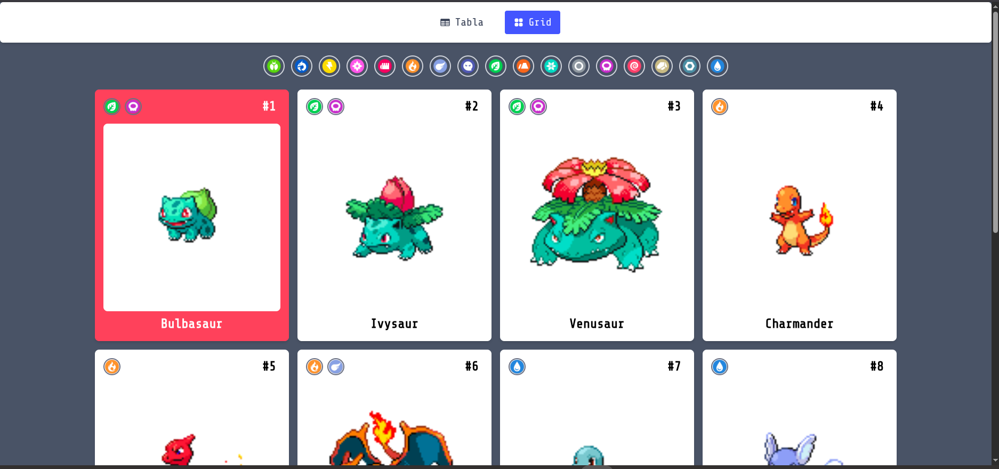
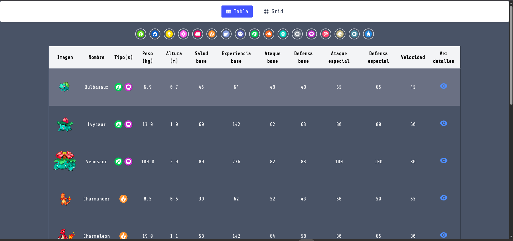

# 🚀 Pokédex - React + Tailwind + PokéAPI

Explora los 151 Pokémon de la primera generación en una interfaz moderna e interactiva construida con **React**, **TypeScript**, **Tailwind CSS** y **PokéAPI**. Incluye vista en tabla, cuadrícula responsive, filtrado por tipo con íconos, paginación y modal de detalles con estadísticas visuales.

---

## 🖥️ Vistas del proyecto

---

## 🌐 Demo en vivo

🔗 [Ver demo en GitHub Pages](https://tuusuario.github.io/pokedex)

---

## 🛠️ Tecnologías utilizadas

- [React](https://reactjs.org/)
- [TypeScript](https://www.typescriptlang.org/)
- [Vite](https://vitejs.dev/)
- [Tailwind CSS](https://tailwindcss.com/)
- [PokéAPI](https://pokeapi.co/)
- [Heroicons](https://heroicons.com/)
- [TanStack Table](https://tanstack.com/table)

---

## ⚙️ Instalación local

Para correr la aplicación de manera local sigue estos pasos:

### 1. Clona el repositorio

git clone https://github.com/tuusuario/pokedex.git
cd pokedex

### 2. Instala las dependencias

npm install

### 3. Crea e archivo .env en la raiz del proyecto con este contenido

POKEMON_API_URL=https://pokeapi.co/api/v2/pokemon?limit=151

### 4. Por ultimo ejecuta el proyecto 

npm run dev

## 📁 Estructura principal del proyecto

pokedex/
├── public/
|   ├── icons/          # Íconos de tipos
├── src/
│   ├── components/      # Componentes reutilizables 
│   ├── hooks/           # Custom hooks (usePokemon)
│   ├── interfaces/      # Tipado de datos
│   ├── utils/           # Funciones auxiliares 
│   └── App.tsx          # Componente principal
├── .env
├── package.json
├── tailwind.config.js
└── README.md
